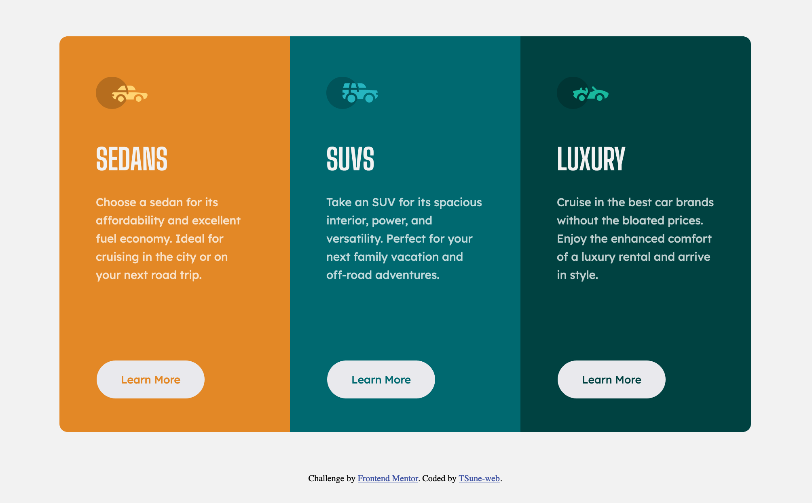
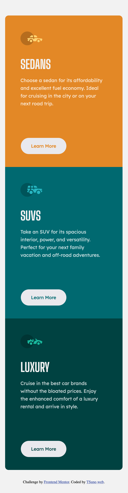

# Frontend Mentor - 3-column preview card component solution

This is a solution to the [3-column preview card component challenge on Frontend Mentor](https://www.frontendmentor.io/challenges/3column-preview-card-component-pH92eAR2-). Frontend Mentor challenges help you improve your coding skills by building realistic projects. 

## Table of contents

- [Overview](#overview)
  - [The challenge](#the-challenge)
  - [Screenshot](#screenshot)
- [My process](#my-process)
  - [Built with](#built-with)
  - [What I learned](#what-i-learned)
  - [Continued development](#continued-development)
  - [Useful resources](#useful-resources)


## Overview

### The challenge

Users should be able to:

- View the optimal layout depending on their device's screen size
- See hover states for interactive elements

### Screenshot





## My process

### Built with

- Semantic HTML5 markup
- CSS custom properties
- Flexbox


### What I learned

Defining and using custom properties 
```css
:root {
  --primary-clr: grey;
}
p {
  color: var(--primary-clr);
}
```

Using media queries for responsive design
```css
@media (max-width: 800px) {
  h1 {
    font-size: 32px;
  }
}
```


### Continued development

Positioning
  - Have more control of flexbox and other technique to position items at will.
Responsive Design
  - Use relative units and media queries more aptly depending on a project.


### Useful resources

- [MDN Web Docs](https://developer.mozilla.org/en-US/docs/Web) - This helped me create this challenge especially with responsive design.
